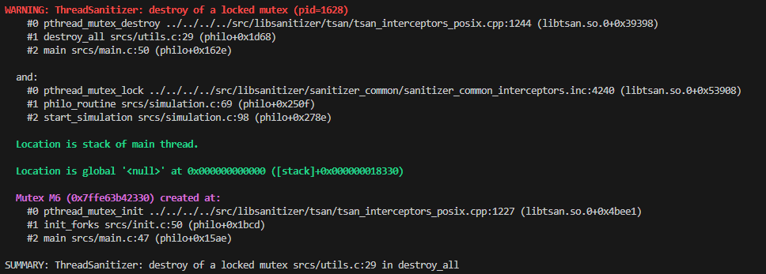
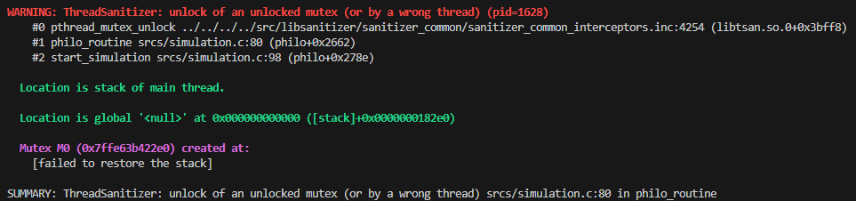
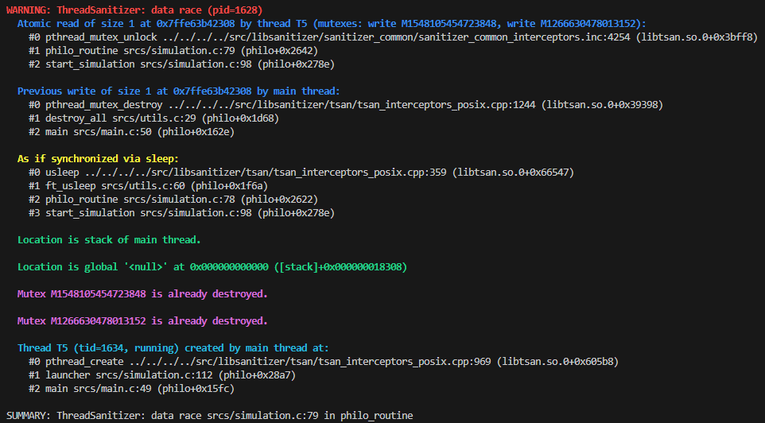
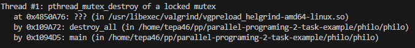
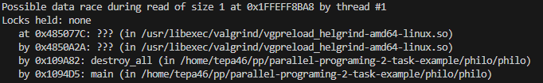

# Инструменты анализа кода

Отчет по второй задаче курса "Параллельное программирование".

## Анализируемый проект

Проект, выбранный для анализа на наличие гонки данных: https://github.com/dpetrosy/42-Philosophers

Проект написан на `C++` без использования библиотеки `openMP`.

Автор предлагает многопоточную реализацию простой стратегии для задачи об обедающих философах.

## Анализ проекта
#### Как работает?
При старте приложения происходит инициализация необходимых структур данных,
в том числе мьютексов. После чего запускается лаунчер который,
инициирует запуск потоков для философов, крутящих бесконечные циклы,
и запуск потока для сущности `obsorver` проверяющей условия окончания трапезы.
В лаунчере ожидается окончании работы `obsorver`,
после чего вызывается функция `destroy_all`, разрушающая мьютексы,
и приложение заканчивает работу.

### Анализируем с помощью threadsanitizer

Добавляем в `Makefile` флаг `-fsanitize=thread -g`.

Запускаем `./philo 5 800 200 200 7` и получаем:

1. `WARNING: ThreadSanitizer: destroy of a locked mutex`
   1. Из `obsorver` вызывается `destroy_all` до того, как философы отпустили все мьютексы.
2. `WARNING: ThreadSanitizer: unlock of an unlocked mutex`
   1. Попытка отпустить разрушенный мьютекс.
3. `WARNING: ThreadSanitizer: data race`
   1. Сначала мьютекс разрушится или освободится? Вот так вот.

ThreadSanitizer: reported 13 warnings

Примеры логов

### Анализируем с помощью Helgrind

Запускаем `valgrind --tool=helgrind ./philo 5 800 200 200 7` и получаем:

1. `pthread_mutex_destroy of a locked mutex`
2. `Possible data race during read of size 1 at 0x1FFEFF8BA8`

ERROR SUMMARY: 21 errors from 6 contexts (suppressed: 10389 from 37)

Примеры логов

## Исправление ошибок data race

Проблема заключается в том, что во время уничтожения мьютексов сами мьютексы могут быть еще не отпущены философами.

Для решения проблемы перенесем логику проверки условий окончания трапезы в потоки философов.

Логи `threadsanitizer` пропали.

Логи `helgrind` связанные с data race также пропали. Однако остались логи, указывающие на блокировку мьютексов одних вилок разными философами, не являющиеся ошибкой с точки зрения логики программы.

